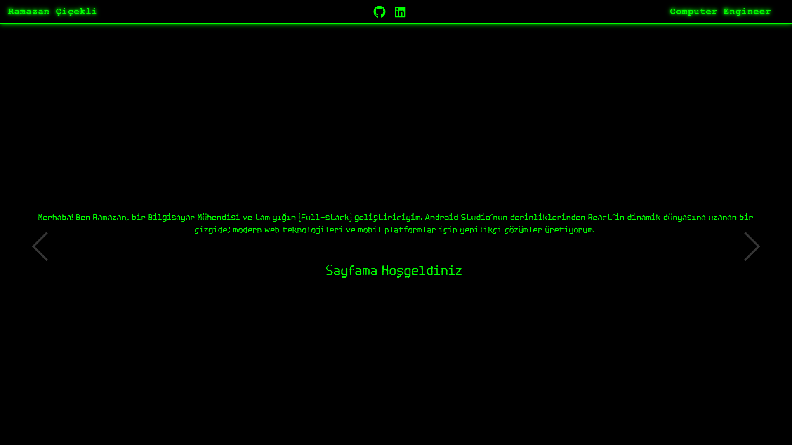
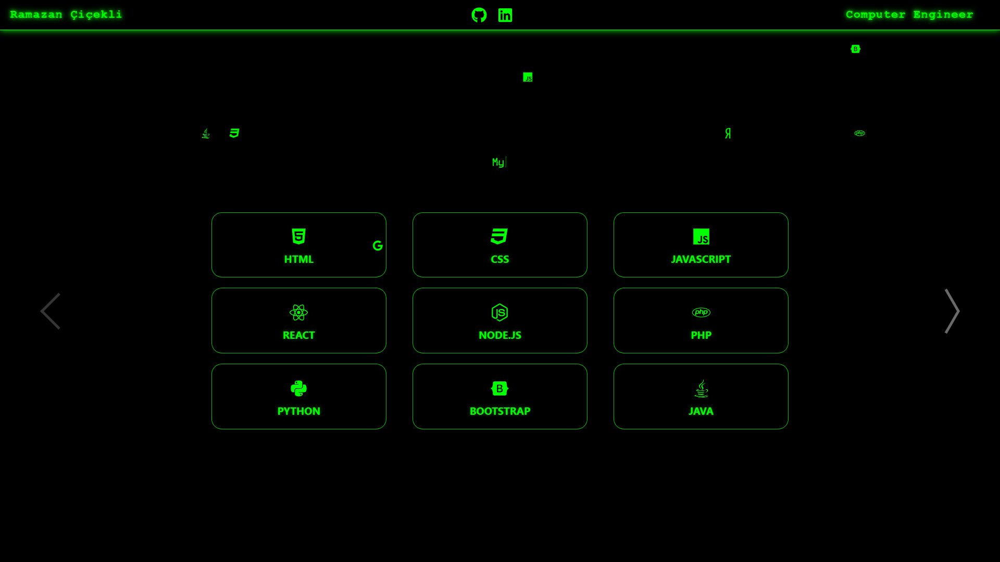
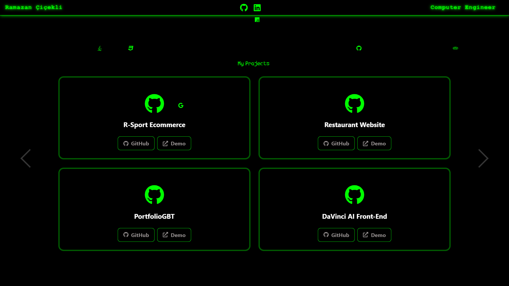
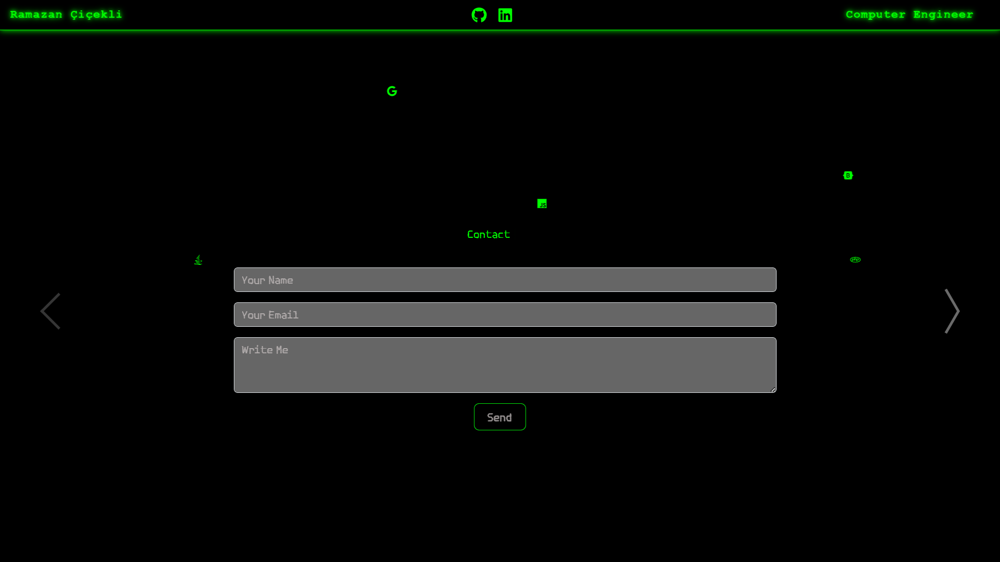

## 🟢 MATRIX-THEMED DEVELOPER PORTFOLIO

> 🚀 Modern React tabanlı, Matrix filminden ilham alan interaktif geliştirici portfolyo projesi

---

## 🌐 PROJE LİNKİ

🔗 Live Demo: https://developer-portfolio-mu-five.vercel.app/

---

## 🎯 PROJE HAKKINDA

Bu proje, Matrix filmi estetiğinden ilham alınarak geliştirilmiş modern bir developer portfolio web uygulamasıdır.  
Amaç; projeleri, yetenekleri ve kişisel bilgileri **interaktif ve görsel olarak etkileyici bir şekilde sunmaktır.**

---

## 📸 SCREENSHOTS

| Matrix 1 | Matrix 2 |
|----------|----------|
|  |  |

| Matrix 3 | Matrix 4 |
|----------|----------|
|  |  |

## ✨ ÖZELLİKLER

- 🟢 Matrix temalı cyberpunk UI tasarımı
- ⌨️ Typewriter efekti ile dinamik yazı animasyonu
- 🎞️ React Awesome Slider ile animasyonlu sayfa geçişleri
- 💻 Interaktif proje kartları (GitHub yönlendirmeli)
- 🌨️ Teknoloji ikonlarıyla “matrix rain” benzeri efekt
- 📱 Tam responsive tasarım
- 🧭 Sticky ve dinamik navbar
- 🎨 Custom CSS ile tamamen özel tasarım sistemi

---

## ⚙️ KULLANILAN TEKNOLOJİLER

- ⚛️ React
- 🎞️ react-awesome-slider
- ⌨️ typewriter-effect
- 🎨 React Bootstrap / Reactstrap
- 📦 Font Awesome Icons
- 💡 JavaScript (ES6+)
- 🌐 Custom CSS

---

## 🧠 PROJE YAPISI

```bash
src/
├── components/
│   ├── MyNav.jsx
│   ├── AboutMe.jsx
│   ├── Projects.jsx
│   ├── Skills.jsx
│   ├── Slider.jsx
│   └── Contact.jsx
├── App.js
├── index.js
└── styles.css
```
---

## 📱 RESPONSIVE YAPI

✔ Desktop uyumlu

✔ Tablet uyumlu

✔ Mobil uyumlu

---
## 👨‍💻 GELİŞTİRİCİ

Ramazan Çiçekli

GitHub: https://github.com/rcicekli

LinkedIn: https://www.linkedin.com/in/rcicekli/

---
## ⭐ DESTEK

Projeyi beğendiysen ⭐ vermeyi unutma!
